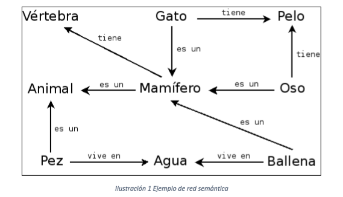
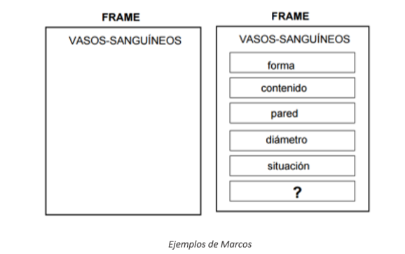
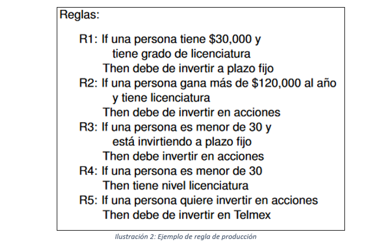

# TÉCNICAS DE REPRESENTACIÓN DEL CONOCIMIENTO EN INTELIGENCIA ARTIFICIAL
###### Víctor M. Rodríguez - ETSI Universidad de Huelva - Representación del Conocimiento 2019-2020

## Lógica
La representación lógica consiste en un lenguaje con reglas definidas de tal manera que no exista la ambigüedad. 
Nos permite llegar a una conclusión tras aplicar unas condiciones.

###### Lenguaje natural
```
1.	Marco era pompeyano.
2.	Todos los pompeyanos eran romanos.
3.	Cada romano, o era leal a César, o le odiaba.
4.	Todo el mundo es leal a alguien.
5.	La gente sólo intenta asesinar a aquellos a quienes no es leal.
6.	Marco intentó asesinar a César.
7.	Todo pompeyano es leal a su padre.
```
###### Lógica de Primer Orden 
```
1.	P(Marco)
2.	∀x(P(x)→R(x))
3.	∀x(R(x)→(L(x,Cesar)∨O(x,Cesar))
4.	∀x∃yL(x,y)
5.	∀x∀y(IA(x,y)→¬L(x,y))
6.	IA(Marco,Cesar)
7.	∀x(P(x)→L(x,f(x)))
```
Se basa en reglas de comunicación que definen una sintaxis y semántica precisa:
#### Sintaxis
-	Cómo se construyen las frases en la lógica.
-	Los símbolos que podemos usar.
-	La forma de colocar esos símbolos.
#### Semántica
-	Cómo podemos interpretar las sentencias.
-	Define el significado de la lógica.
####Ventajas
-	La representación lógica ayuda a realizar el razonamiento lógico.
-	Es la base de los lenguajes de programación, eg. Prolog (lógica de predicados). 
#### Desventajas
-	A veces puede ser difícil modelar el lenguaje natural.
-	Las inferencias no son muy eficientes.

## Redes semánticas
Las redes semánticas permiten almacenar el conocimiento en forma de una red con nodos y aristas representando los objetos y sus relaciones. 
Se pueden representar objetos físicos, conceptos o incluso situaciones.

<p align="center">
  
</p>

Podemos distinguir tres categorías de redes semánticas:
- Redes IS-A (es un), en las que los enlaces entre nodos están etiquetados.
- Gráficos conceptuales: en los que existen dos tipos de nodos: de conceptos y de relaciones.
- Redes de marcos: en los que los puntos de unión de los enlaces son parte de la etiqueta del nodo.

#### Ventajas
Las redes semánticas son una representación natural del conocimiento.
Aportan mucho significado en una manera simple y fácil de entender.

#### Desventajas
Requieren mayor tiempo de cómputo en ejecución.
No son inteligentes y dependen del creador del sistema.

## Marcos
Los marcos son registros que consisten en una colección de atributos y valores para describir una entidad. Se usan para dividir el conocimiento en subestructuras. Implementan redes semánticas relacionando unos marcos con otros usando el concepto de herencia.
Los marcos se usan para representar conocimiento estereotipado o construido a partir de experiencias y características bien conocidas.

#### Tipos de marcos:
-	Marcos clase, o marcos genéricos, que representan conocimiento de clases de objetos.
-	Marcos instancia, representan conocimiento de objetos individuales.

<p align="center">
  
</p>

#### Los marcos presentan muchas ventajas:
-	Habilidad para documentar información acerca de un modelo; por ejemplo, maquinaria de una planta y atributos asociados.
-	Habilidad para restringir posibles valores que un atributo puede tomar.
-	Modular la información, permitiendo facilidad de expandir y mantener el sistema.
-	Sintaxis consistente y fácil de leer, para referenciar objetos del área. e. Restringir la secuencia de hechos considerados durante encadenamientos.
-	Posibilitar acceso a mecanismos que soportan la herencia de información.
#### Aunque algunas desventajas:
-	No hay ninguna estandarización.
-	El mecanismo de inferencia no es simple.
-	Difícil de mantener y actualizar una amplia red de marcos.

## Reglas de producción
En las reglas de producción, el agente comprueba las precondiciones y si se cumplen, se dispara la regla de producción y la correspondiente acción es llevada a cabo. La parte condicional de la regla determina qué regla se puede aplicar al problema, mientras que la parte de la acción ejecuta el paso para resolver el problema. Este proceso completo se conoce como ciclo de “recognize-act”.
El sistema de reglas de producción consta de tres partes principales:
-	El conjunto de reglas de producción (base del conocimiento).
-	Memoria de trabajo: guarda inferencias/aseveraciones temporalmente
-	Ciclo “recognize-act”: Aparea las condiciones, resuelve conflictos y dispara la regla.

<p align="center">
  
</p>

#### Ventajas
-	Las reglas de producción se expresan en lenguaje natural
-	Altamente modulares y se pueden eliminar o modificar fácilmente.
-	Es muy sencilla su representación en la lógica.

#### Desventajas
-	No presenta aprendizaje.
-	No almacena el resultado del problema para usos futuros.
-	Muy ineficiente si se abren muchas reglas de producción simultáneamente en un programa.
 
## Bibliografía
- https://www.edureka.co/blog/knowledge-representation-in-ai/
- https://www.slideshare.net/YasirAhmedKhan/5-knowledgerepresentation-10-sldes
- http://www.cs.us.es/~fsancho/?e=224
- https://es.wikipedia.org/wiki/Red_sem%C3%A1ntica
- https://www.quora.com/What-are-frames-in-the-knowledge-representation-of-artificial-intelligence-and-its-identification-information
- https://freedoomforlife.wordpress.com/marcos-frames/
- https://ccc.inaoep.mx/~emorales/Cursos/InteligenciaArtificial/Acetatos/logregrel.pdf


